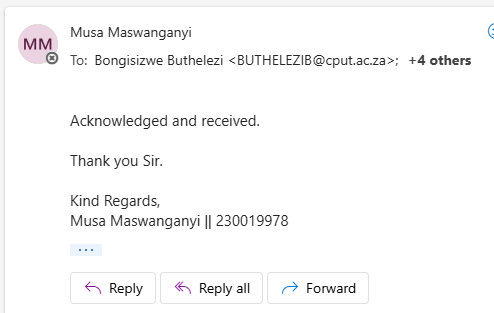

# Musa-Maswanganyi-GitHub-Portfolio

🎓 **Diploma in ICT (Communication Networks) – Third Year Student**  
🌐 **Aspiring Cybersecurity and Network Support Professional**  
## 📫 Contact Details:
- 📧 Email: 230019978@mycput.ac.za
- 🔗 LinkedIn: [Musa Maswanganyi](https://www.linkedin.com/in/musa-maswanganyi)
- 💻 GitHub: [github.com/Musa-Maswanganyi](https://github.com/Musa-Maswanganyi)
---

## 👨‍💻 About Me

I’m **Musa Maswanganyi**, a dedicated and passionate ICT student with hands-on experience in network engineering, technical support, and cybersecurity fundamentals.  
This digital portfolio showcases my professional readiness, interview preparation, and business communication skills developed through the Work Readiness Training program.  

---

## 📌 Table of Contents
- [🗣️ Business Communication](#business-communication)
- [🎤 Interview Skills](#interview-skills)
- [🎥 Mock Interview](#mock-interview)
- [🌐 Professional Networking](#professional-networking)
- [🤝 Workplace Etiquette](#workplace-etiquette)
- [🧠 Professional Growth Summary](#professional-growth-summary)

---

## 🗣️ Business Communication

### 🖼️ Evidence

### 🖼️ 

### Reflection
 At the start of the course, I struggled to express my thoughts clearly and professionally in formal settings. I realized that while my technical communication was solid, my business communication needed improvement. 
 My goal was to improve how I write emails, reports, and communicate in meetings. I attended training sessions on workplace communication and practiced using a professional tone.  
 I started applying what I learned by writing structured reports and professional emails for assignments. I also sought feedback from lecturers to refine my tone and style.  
 Now I can confidently communicate with clarity and professionalism. I am able to adjust my language for different audiences, which helps me work effectively with colleagues and clients. 

---

## 🎤 Interview Skills

### 🖼️ Evidence

###  Reflection
 Before training, interviews made me anxious, and I often struggled to explain my strengths confidently. I realized that preparation and structure were key to performing better. 
 My task was to improve my interview confidence and develop the ability to present my experience clearly. I studied common ICT interview questions and practiced answering them aloud. I used Chat gpt to help ask me interview questions to better prepare myself.   
 I took part in mock interviews where I applied professional etiquette and used clear examples to describe my skills. I practiced eye contact, tone, and posture during these sessions.  
 After practicing repeatedly, I became more confident and calm during interviews. I now communicate my experience effectively and can respond to both technical and personal questions with confidence. 

---

## 🎥 Mock Interview

🎬 **[Watch My Mock Interview](https://github.com/wil-it2025/cv-tutorial-Musa-Maswanganyi/blob/main/compressvideo.mp4)**

###  Reflection
 When recording my mock interview, I was initially nervous about being on camera and maintaining professionalism. I wanted to demonstrate my communication and confidence skills effectively.   
 My goal was to conduct a professional interview that reflected what I learned about preparation and presentation. I researched possible interview questions and practiced multiple times before recording.   
 During the mock interview, I spoke clearly, maintained eye contact, and used structured responses to highlight my strengths. I also reviewed my recording to identify areas of improvement.   
 This process improved my self-awareness and presentation skills. I now feel prepared for real interviews and can confidently showcase my technical and interpersonal abilities. 

---

## 🌐 Professional Networking

### 🖼️ Evidence

###  Reflection
 Before this training, I didn’t fully understand how networking could influence my career growth. I often focused only on technical skills and ignored the importance of building connections.   
 I aimed to create a professional online presence that would help me engage with people in the ICT field. I decided to create and optimize a LinkedIn profile showcasing my academic and technical achievements.   
 I followed industry professionals, joined relevant groups, and interacted in discussions to grow my network. I also started sharing updates about my projects and achievements online.   
 Through networking, I have connected with professionals who inspire me and share valuable career advice. This experience taught me that career growth is not only about skills but also about relationships and reputation. 

---

## 🤝 Workplace Etiquette

### 🖼️ Evidence

###  Reflection
 At first, I underestimated how important etiquette and behavior are in a professional setting. I focused mainly on technical performance instead of teamwork and conduct.   
 I needed to develop professional habits that make me a dependable and respectful employee. I joined workshops on professional behavior, time management, and workplace culture.   
 I practiced professionalism by being punctual, dressing appropriately, and showing respect during group work. I also observed how others behaved in simulated work environments.   
 Now I can maintain proper etiquette in professional environments. I understand how to handle conflict respectfully, communicate clearly, and contribute positively to a team. 

---

##  Final Reflection

 The Work Readiness Programme has prepared me for both professional and personal growth. 
It taught me that success in ICT requires more than just technical skill — it also requires communication, professionalism, and confidence.
I have developed the ability to work well in teams, communicate effectively, and behave professionally in any environment.
This experience has given me the foundation to begin my career confidently and adapt to new challenges with a professional mindset. 

---

> © 2025 Musa Maswanganyi | Work Readiness Digital Portfolio | PRP370-1 | November 2025
